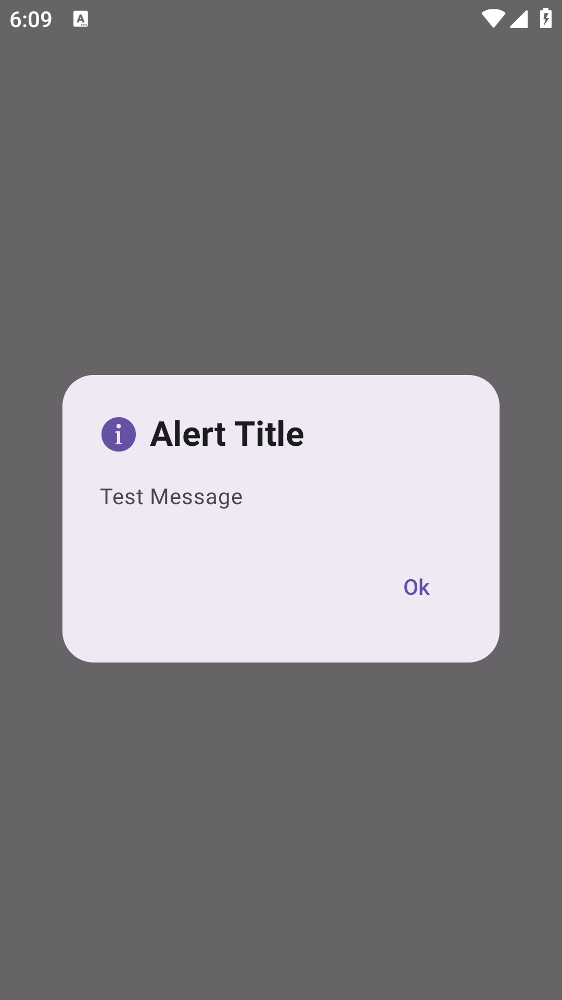
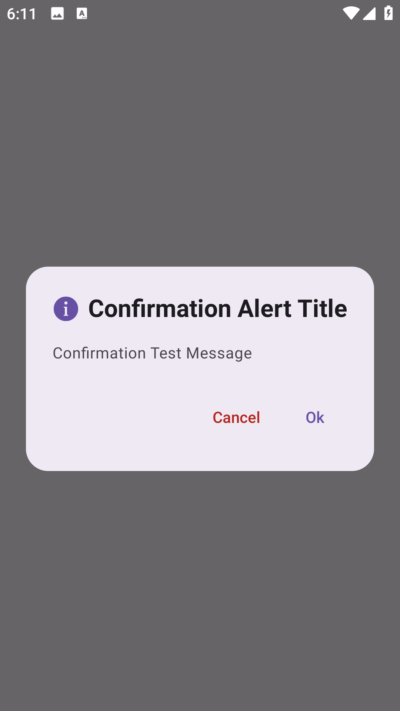

# 🌟 BMNVAlert - Elegant Alert Dialogs for Jetpack Compose

BMNVAlert provides a polished, highly customizable alert dialog solution for Jetpack Compose applications. With just a single composable call, you can show **simple alerts**, **confirmation dialogs**, and optionally include **icons** and **auto-dismiss** timers.

---

## ✨ Features

- ✅ Modern Material 3 Design
- 🔔 Simple alerts with optional auto-dismiss
- ⚠️ Confirmation dialogs with customizable button texts
- 🎨 Support for icons using drawable resources
- 🧼 Clean and reusable API with minimal boilerplate
- ⚡ Built entirely with Jetpack Compose

---

## 🧩 Quick Start

### 🔹 Simple Alert

```kotlin
CreateAlert(
    alertType = AlertType.INFO,
    title = "Welcome",
    message = "This is a simple alert",
    autoDismissInMillis = 3000L,
    drawableRes = R.drawable.ic_info,
    onDismiss = { /* handle dismiss */ }
)
```

---

### 🔹 Confirmation Alert

```kotlin
CreateConfirmationAlert(
    alertType = AlertType.WARNING,
    title = "Delete Item",
    message = "Are you sure you want to delete this item?",
    positiveButtonText = "Yes",
    negativeButtonText = "No",
    drawableRes = R.drawable.ic_warning,
    onDismiss = { /* handle cancel */ },
    onConfirm = { /* handle confirm */ }
)
```

---

## 🧪 API Reference

### 🔸 `CreateAlert(...)`

```kotlin
/**
 * @param alertType Type of alert to show.
 * @param title Title of the alert.
 * @param message Message of the alert.
 * @param autoDismissInMillis Time in milliseconds to dismiss the alert automatically.
 *        Pass null to disable auto-dismiss.
 * @param drawableRes Drawable resource to show with the alert.
 * @param onDismiss Callback to be invoked when the alert is dismissed.
 */
@Composable
fun CreateAlert(
    alertType: AlertType,
    title: String,
    message: String,
    autoDismissInMillis: Long? = null,
    @DrawableRes drawableRes: Int? = null,
    onDismiss: () -> Unit
)
```

---

### 🔸 `CreateConfirmationAlert(...)`

```kotlin
/**
 * @param alertType Type of alert to show.
 * @param title Title of the alert.
 * @param message Message of the alert.
 * @param positiveButtonText Text of the positive button.
 * @param negativeButtonText Text of the negative button.
 * @param drawableRes Drawable resource to show with the alert.
 * @param onDismiss Callback to be invoked when the alert is dismissed.
 * @param onConfirm Callback to be invoked when the positive button is clicked.
 */
@Composable
fun CreateConfirmationAlert(
    alertType: AlertType,
    title: String,
    message: String,
    positiveButtonText: String = "Ok",
    negativeButtonText: String = "Cancel",
    @DrawableRes drawableRes: Int? = null,
    onDismiss: () -> Unit,
    onConfirm: () -> Unit
)
```

---

## 🔧 Enums

```kotlin
enum class BMNVAlertType {
    SIMPLE_ALERT,
    CONFIRMATION_ALERT
}

enum class AlertType {
    INFO,
    SUCCESS,
    WARNING,
    ERROR
}
```

---

## 📸 Screenshots

### 🔹 Simple Alert


### 🔹 Confirmation Alert



---

## 💡 Tips

- Use `autoDismissInMillis` to auto-dismiss alerts after a set delay.
- You can customize the visuals using your app's theme or styling system.
- Vector icons (`drawableRes`) work best for clean UI.

---

## 📄 License

This component is free to use under the **MIT License**.  
© 2025 [YourName](https://github.com/yourusername)

---

## 🙌 Contribute

Found a bug or want to add new features?  
Feel free to open issues or submit a pull request!

---

## ⭐ Support

If you found this helpful, give this repo a ⭐ to show your support!
